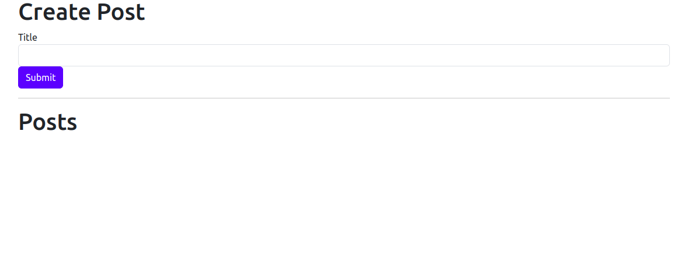
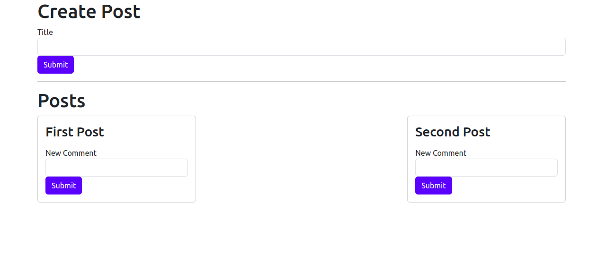
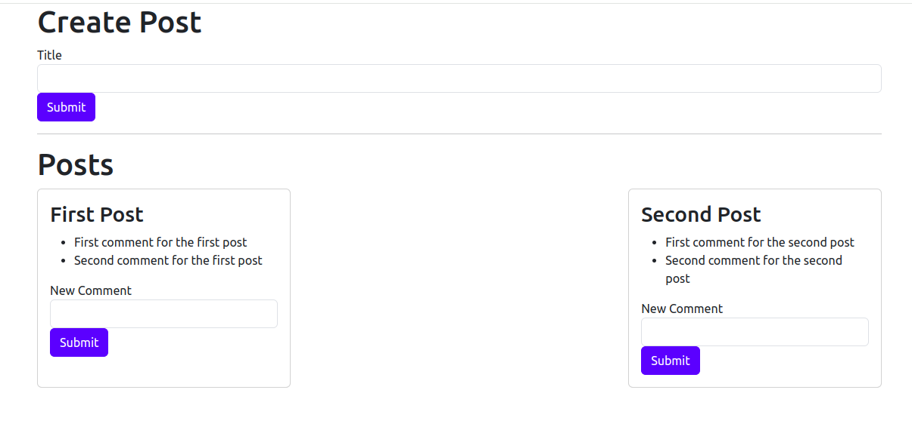
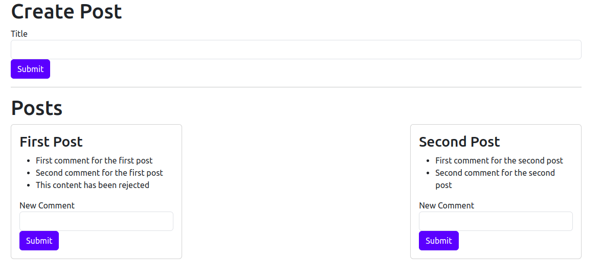
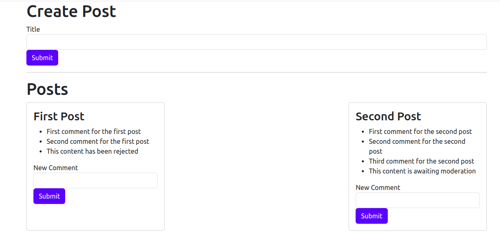

# Microservices Blog Application

This project is a simple microservices-based application designed to create and manage posts and comments. The goal of this application is to introduce key concepts of microservices architecture by building each service from scratch.

# Overview

The application allows users to create posts and add comments to them. The architecture consists of multiple microservices, each handling a distinct part of the application’s functionality, including posts, comments, moderation, and a query service.

## Final Product

**Homepage:**



**View of Adding New Posts:**



**View of Adding New Comments:**



**View of Rejecting the Comment if the Comment Contains the Word orange:**



**View of Showing the comment that it is Awaiting Moderation when Moderation Service is Down:**



# Features

* **Create Posts:** Users can create new posts with a title.

* **Add Comments:** Users can add comments to posts.

* **Moderation:** Comments are moderated by a moderation service, filtering out comments containing specific words (e.g., "orange").

* **Real-time Updates:** The status of comments (approved, pending, rejected) is updated in real-time.

* **Query Service:** Aggregates and serves data from different services for display in the front-end.

# Services

1. **Post Service:**

* Handles creation and retrieval of posts.

* Emits events when a post is created.

2. **Comment Service:**

* Handles creation and retrieval of comments.

* Responsible for moderating comments based on content.

* Emits events when a comment is created or updated.

3. **Moderation Service:**

* Filters comments to flag inappropriate content (e.g., containing the word "orange").

* Emits events when a comment is moderated.

4. **Query Service:**

* Aggregates data from the Post and Comment services.

* Serves the combined data to the front-end.

5. **Event Bus:**

* Manages communication between services via event-based messages.

# Architecture

The application uses a microservices architecture where each service is responsible for a specific domain or functionality. Services communicate with each other through an event bus, which handles both synchronous and asynchronous communication patterns.

# Usage

1. Create a post by entering a title and clicking "Submit."

2. Add comments to the post.

3. Comments will be moderated, and their status will be displayed (Approved, Pending, or Rejected).

# Tech Stack 🛠️

* **Frontend:** React, Bootstrap
  
* **Backend:** Express.js

* **Communication:** Axios (for API requests), Event Bus (for microservice communication)

* **Architecture:** Microservices

* **Languages:** JavaScript (Node.js)

# Project Structure

```
├── event-bus
│   ├── index.js
│   └── package.json
├── posts
│   ├── index.js
│   └── package.json
├── comments
│   ├── index.js
│   └── package.json
├── moderation
│   ├── index.js
│   └── package.json
├── query
│   ├── index.js
│   └── package.json
└── README.md
```